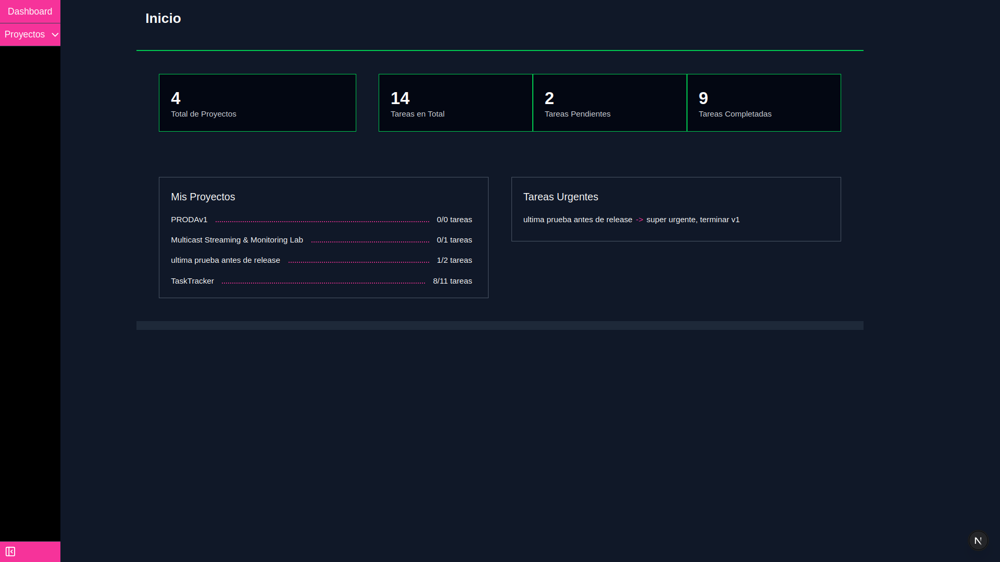
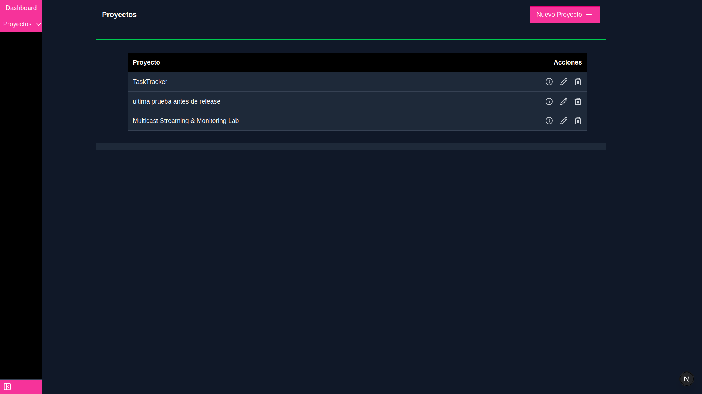
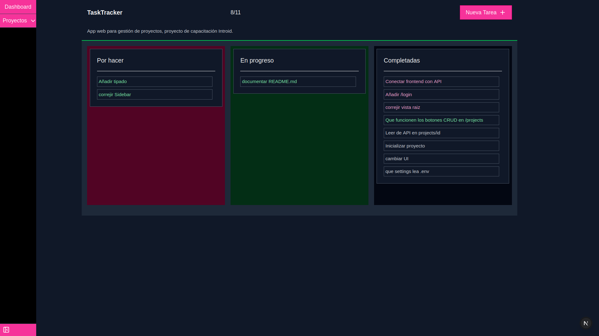

### TaskTracker
Aplicación web ligera para manejo de proyectos y tareas al estilo kanban.

1. [Cómo Usar](#cómo-usar)
2. [Setup](#setup)
3. [Arquitectura](#arquitectura)
4. [TODO](#todo)
5. [Aviso Legal](#aviso-legal)
6. [Fuentes e Íconos](#fuentes-e-íconos)
  
#### Cómo Usar:
1. Iniciar sesión, todas las rutas excepto `/login` requieren token JWT para responder peticiones.
2. Navegar a la ruta que tenga la funcionalidad deseada:

| Ruta | Funcionalidad |
| :- | :- |
| `/` | Dashboard |
| `/projects` | CRUD de proyectos |
| `/projects/<id>` | Tablero Kanban drag 'n' drop para tareas de un proyecto |

Dashboard

Projects

Project Kanban


^La aplicación no ofrece ninguna vista para crear usuarios, los usuarios se deben crear con la shell de Django:
```
(.venv) ***$ python3 manage.py shell
14 objects imported automatically (use -v 2 for details).
  
Python 3.12.3 (main, Jun 19 2026, 12:46:00) [GCC 13.3.0] on linux
Type "help", "copyright", "credits" or "license" for more information.
(InteractiveConsole)
>>> from users.models import User
>>> User.objects.create_user("user", "user")
<User: user>
>>>
```

#### Setup
##### Desarrollo
1. Instalar `Node.js 24`, `yarn 1.22` y `Python 3.12`.
2. Clonar el repositorio.
3. Instalar dependencias (`yarn`, `pip`/`uv`/`conda`...).
4. Establecer variables de entorno, consultar  `frontend/.env.example` y `backend/.env.example`.
5. Ejecutar los servicios frontend y backend con `yarn dev` y `python manage.py runserver`.

##### Producción
No listo aún...
 
#### Arquitectura
Next.js y Django (DRF) hacen casi todo al definir arquitectura de componentes/app router y MVT modificado respectivamente.

Algunos axiomas del proyecto:
- No se garantiza que la app sea funcional después de cada commit ni pull request, solo después de un release explícito.
- Los proyectos y tareas son compartidos por todos los usuarios, el login es solo para filtrar el acceso a personas autorizadas, no para segregar tareas y proyectos existentes en la base de datos.
- La interfaz de usuario es responsiva via CSS Grid.

Algunos axiomas del código:
- En el backend, el único lugar que lee `.env` es `settings.py`.
- `api.js` y `server-api.js` son prácticamente iguales en cuanto a lógica, la diferencia es que `api.js` se utiliza en client components y `server-api.js` se utiliza en server components.
- Hay dos tipos de redireccionamiento: el controlado por Next.js en las navegaciones del usuario (cambio de rutas por un botón, modificación de URL directa en el navegador, redirección de `proxy.ts` tras caducar token JWT), y el controlado por `api.js`/`server-api.js` tras una petición (únicamente hacia `/login` en caso de que el token JWT haya caducado).
- La redireccion de `api.js` es la única que limpia cachés, esto es aceptable en esta aplicación cuando la sesión ya expiró.

#### TODO:
- Si aumenta mucho la lógica de filtros del filtrado de datos, esta puede ser extraída a una capa `services`; en medio de `models` y `views`.
- `api.js` empezó como un método generalizado para hacer peticiones, pero al momento de añadir chequeo de seguridad por token JWT, se le terminó añadiendo redireccionamiento de usuarios no autenticados hacia la vista `/login`. Si esta lógica crece, puede ser beneficioso extraerla a un módulo individual.

##### Aviso Legal
...

##### Fuentes e Íconos
Por LucideReact, revisar licencia antes de su redistribución.
